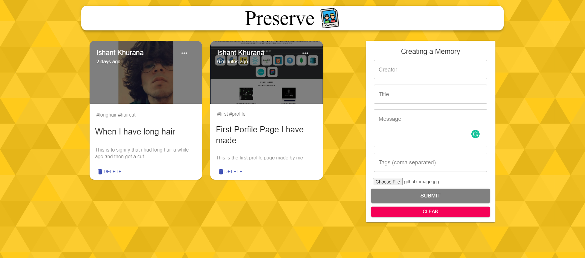

# Preserve_Website-Where_your_memories_are_alive



## Introduction

The App is called "Preserve" and it is a simple app made to be used by the users to relive their memories, or important and precious moments of their life.

# Getting Started
To get started you can simply clone this `Preserve_Website-Where_your_memories_are_alive` repository and install the dependencies.

Clone the `Preserve_Website-Where_your_memories_are_alive` repository using git:

```
git clone https://github.com/ISHANT3011/Preserve_Website-Where_your_memories_are_alive.git

cd Preserve_Website-Where_your_memories_are_alive
```

Start off with :

```
cd client
npm install
npm start
```

Before running the server, open another instance of system terminal go to server folder and do the commands given below to run your application
```
npm install
npm start
```


 # Tech Stack 
- Node.js
- JavaScript
- React
- Express.js
- MongoDB

